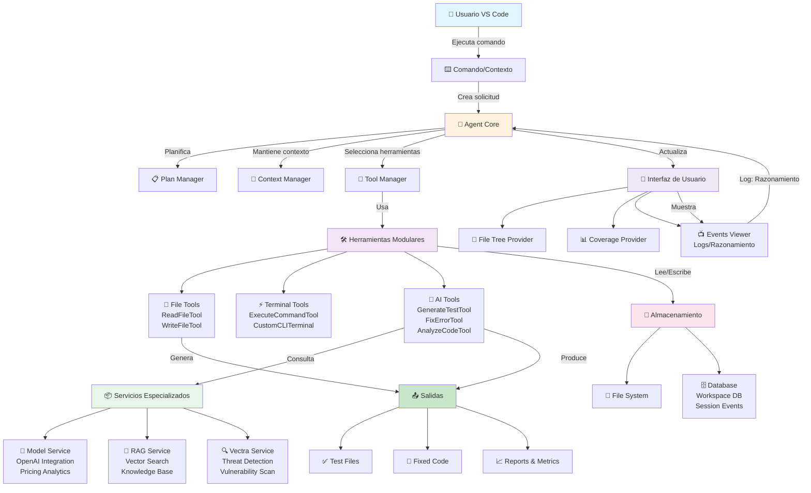
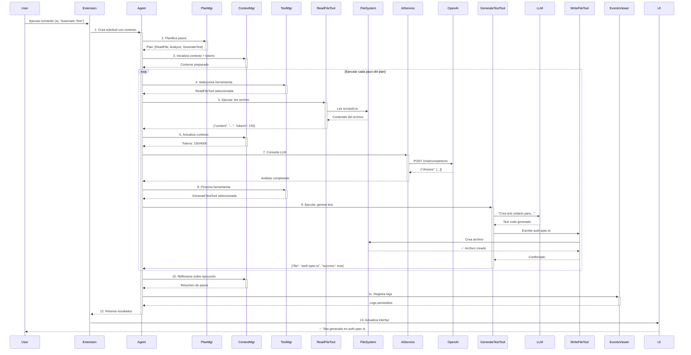

# Grec0AI For Developers — VS Code Extension

[](https://marketplace.visualstudio.com/items?itemName=grec0ai.grec0ai-vscode)
[](https://github.com/gcorroto/autofixer_extension)
[](#licencia)
[]()

<div align="center">

**Una extensión de VS Code potenciada por IA para automatizar tests, análisis de código y resolución de errores**

[📦 Instalar](#instalación) • [🚀 Inicio Rápido](#inicio-rápido) • [📚 Documentación](#documentación) • [🤖 Arquitectura](#arquitectura-basada-en-agentes) • [🆘 Soporte](#soporte)

</div>

---

## Tabla de Contenidos

1. [Visión General](#visión-general)
2. [Características Principales](#características-principales)
3. [Arquitectura](#arquitectura-basada-en-agentes)
4. [Instalación](#instalación)
5. [Inicio Rápido](#inicio-rápido)
6. [Comandos y Funcionalidad](#comandos-y-funcionalidad)
7. [Configuración](#configuración)
8. [Flujos de Trabajo](#flujos-de-trabajo)
9. [Panel de Actividad](#panel-de-actividad-grec0ai)
10. [Documentación Adicional](#documentación-adicional)
11. [Solución de Problemas](#solución-de-problemas)
12. [Contribuir](#contribuir)
13. [Licencia](#licencia)

---

## Visión General

**Grec0AI For Developers** es una extensión avanzada para Visual Studio Code que integra capacidades de **inteligencia artificial** basada en agentes para transformar el ciclo de desarrollo:

- 🤖 **Generación automática de tests unitarios** con retroalimentación y mejora continua
- 🔧 **Resolución inteligente de errores** con análisis contextual de stacktraces
- 📊 **Análisis profundo de cobertura de código** y mejora automática
- 🛡️ **Detección de vulnerabilidades** (SQL Injection, XSS, CSRF, etc.)
- 🏗️ **Arquitectura basada en agentes** (II-Agent) con planificación y razonamiento
- ⚡ **AutoFixer** — Ejecución automática de instrucciones en el workspace
- 📈 **Ciclo de retroalimentación continua** que mejora tests hasta alcanzar cobertura mínima

La extensión trabaja directamente con tu código local, proporcionando un flujo completo de desarrollo de alta calidad sin necesidad de infraestructura externa.

---

## Características Principales

### 🧪 Generación Automática de Tests con IA

La característica estrella de Grec0AI: **crea tests unitarios completos y funcionales con un clic**.

#### Capacidades:
- **Análisis contextual**: La IA entiende tu código para generar tests relevantes
- **Múltiples modos**:
  - 🚀 **Modo Rápido**: Generación veloz de tests básicos
  - 🧠 **Modo Razonamiento**: Análisis profundo con niveles de computación (bajo, medio, alto)
- **Ciclo de retroalimentación automático**:
  1. La IA genera un test inicial
  2. Se ejecuta automáticamente
  3. Si falla o baja cobertura: se mejora iterativamente
  4. Continúa hasta alcanzar cobertura mínima (70% por defecto)

#### Uso:
```
1. Abre un archivo fuente (.ts, .js, .py, .java, etc)
2. Clic derecho → "Automatic Test"
3. Selecciona Modo (Rápido/Razonamiento)
4. ¡Listo! Se crea un archivo .spec completo
```

---

### 🛠️ Resolución Automática de Errores

Cuando los tests fallan o encuentras errores en producción, Grec0AI los resuelve automáticamente:

#### Capacidades:
- 📋 **Análisis de stacktraces**: Identifica la raíz de los errores
- 💡 **Sugerencias contextuales**: Propone soluciones específicas
- ✅ **Corrección automática**: Implementa fixes con tu aprobación
- 🔄 **Ciclo de prueba**: Valida que la corrección funciona

#### Uso:
```
1. Selecciona código con errores o haz clic derecho en un error
2. Selecciona "Fix with Grec0AI"
3. Revisa la sugerencia y aprueba
4. La extensión implementa el fix
```

---

### 📊 Análisis y Mejora de Cobertura

Visualiza, analiza y mejora automáticamente la cobertura de código:

#### Capacidades:
- 📈 **Panel visual de cobertura**: Líneas cubiertas, no cubiertas, funciones
- 🎯 **Identificación de gaps**: Señala áreas con baja cobertura
- 🤖 **Generación automática**: Crea tests para incrementar cobertura
- ✔️ **Cumplimiento de estándares**: Asegura mínimo de cobertura (70% configurable)

#### Interfaz:
```
Panel de Actividad Grec0AI
├── 📁 Archivos del Proyecto (navegación)
├── 📊 Resumen de Cobertura
│   ├── Total Coverage: XX%
│   ├── Líneas cubiertas: X/Y
│   ├── Funciones testeadas: X/Y
│   └── Métricas por archivo
└── ℹ️ Detalles (acciones contextuales)
```

---

### 🔒 Detección de Vulnerabilidades

Identifica y previene vulnerabilidades de seguridad automáticamente:

#### Detecta:
- 🚫 SQL Injection, XSS, CSRF
- 🔐 Problemas de autenticación
- 🔑 Gestión insegura de secretos
- 📡 Validación insuficiente de entrada

#### Cumplimiento:
- ✅ OWASP Top 10
- ✅ CWE / CVSS
- ✅ CERT, SANS-Top25
- ✅ PCI-DSS, NIST, MISRA

---

### 🤖 AutoFixer — Ejecución Automática

Ejecuta instrucciones automáticamente cuando abres el workspace, ideal para **CI/CD integrado**:

#### Características:
- ⚙️ **Basado en archivos**: Lee instrucciones desde `autofixer.md` en la raíz
- 🚀 **Desatendido**: Funciona sin intervención del usuario
- 🐳 **CI/CD ready**: Perfecto para contenedores y despliegues
- 📝 **Sintaxis simple**: Instrucciones en markdown legible

#### Ejemplo autofixer.md:
```markdown
# AutoFixer Instructions

## Generar Tests
- GenerateTest: src/services/auth.ts
- GenerateTest: src/utils/validators.ts

## Análisis de Cobertura
- AnalyzeCoverage: src/

## Ejecutar Linters
- ExecuteCommand: npm run lint
- ExecuteCommand: npm run test
```

[📖 Documentación completa de AutoFixer](docs/uso-autofixer.md)

---

## Arquitectura Basada en Agentes

Grec0AI implementa una **arquitectura avanzada basada en agentes II-Agent** que permite planificación, razonamiento y descomposición de tareas complejas:

### 🏗️ Diagrama de Arquitectura



---

### 🔧 Componentes Principales

#### **Núcleo del Agente** (`src/agent/core/`)

| Componente | Responsabilidad |
|-----------|-----------------|
| **Agent.ts** | Orquesta planificación, razonamiento y ejecución de herramientas |
| **AgentPrompt.ts** | Gestiona prompts dinámicos y contexto para el LLM |
| **ContextManager.ts** | Mantiene el historial de conversaciones y tokens |
| **WorkspaceManager.ts** | Proporciona espacios de trabajo aislados por sesión |
| **DatabaseManager.ts** | Persiste eventos e historiales para trazabilidad |
| **AgentToolManager.ts** | Selecciona y ejecuta herramientas según la tarea |

#### **Sistema de Herramientas** (`src/agent/tools/`)

| Herramienta | Función |
|-----------|---------|
| **ReadFileTool** | Lee archivos y proporciona contenido al agente |
| **WriteFileTool** | Escribe y modifica archivos de código |
| **ExecuteCommandTool** | Ejecuta comandos de terminal (npm, python, etc) |
| **GenerateTestTool** | Crea tests unitarios con IA |
| **FixErrorTool** | Analiza y corrige errores automáticamente |
| **AnalyzeCodeTool** | Análisis profundo de código para vulnerabilidades |
| **CustomCLITerminalManager** | Gestiona terminales interactivos con IA |

#### **Servicios Especializados** (`src/services/`)

| Servicio | Propósito |
|---------|----------|
| **openaiService.ts** | Integración con OpenAI (GPT-4, GPT-3.5) |
| **ragService.ts** | Búsqueda semántica de conocimiento (embedding + vector DB) |
| **vectraService.ts** | Análisis de vulnerabilidades y threat detection |
| **modelPricingService.ts** | Cálculo de costos de API en tiempo real |

#### **Interfaz de Usuario** (`src/agent/ui/`)

| Componente | Descripción |
|-----------|-----------|
| **FileTreeProvider.ts** | Árbol navegable de archivos del proyecto |
| **CoverageSummaryProvider.ts** | Panel de cobertura de código |
| **CoverageDetailsProvider.ts** | Detalles granulares de cobertura |
| **EventsViewer.ts** | Visualización de logs y razonamiento del agente |
| **React components** | Dashboards interactivos de flujo y métricas |

---

### 🧠 Flujo de Ejecución del Agente



---

### 🎯 Características del Agente

- ✅ **Planificación adaptativa**: Ajusta el plan según resultados intermedios
- 🧠 **Razonamiento multipasos**: Realiza análisis profundo antes de actuar
- 🔄 **Retroalimentación automática**: Mejora iterativamente resultados
- 💾 **Persistencia**: Registra todas las decisiones y ejecuciones
- 📊 **Observabilidad**: Logs detallados de cada paso y token usado
- 🔌 **Modular**: Herramientas y servicios intercambiables
- 🚀 **Eficiente**: Optimiza tokens y reutiliza contexto

---

## Instalación

### Requisitos Previos

- **Visual Studio Code**: v1.40.0 o superior
- **Node.js**: v12.0.0 o superior (para ejecutar tests)
- **npm**: v6.0.0 o superior
- **Git**: Para control de versiones

### Desde VS Code Marketplace

1. Abre Visual Studio Code
2. Accede a **Extensiones** (`Ctrl+Shift+X`)
3. Busca **"Grec0AI for Developers"**
4. Haz clic en **Instalar**
5. Recarga VS Code

### Instalación Manual

Si prefieres instalar manualmente desde un archivo `.vsix`:

```bash
# Descargar el archivo .vsix desde el repositorio
cd /ruta/a/archivo
code --install-extension grec0ai-vscode-3.0.0.vsix
```

### Instalación desde Fuente

Para desarrollo o compilación personalizada:

```bash
# Clonar repositorio
git clone https://github.com/gcorroto/autofixer_extension.git
cd autofixer_extension

# Instalar dependencias
npm install

# Compilar
npm run build

# Empaquetar como .vsix
npm run package
```

---

## Inicio Rápido

### 1️⃣ Primer Test Generado

```bash
# Abre un proyecto TypeScript en VS Code
code mi-proyecto/

# En un archivo fuente (ej: src/services/auth.ts)
# 1. Clic derecho
# 2. Selecciona "Automatic Test"
# 3. Elige "Modo Rápido"
# 4. ¡Listo! Se creará auth.spec.ts automáticamente
```

### 2️⃣ Resolver un Error

```bash
# Cuando tengas un test fallando o error en console
# 1. Selecciona el código con error
# 2. Clic derecho → "Fix with Grec0AI"
# 3. Revisa la sugerencia
# 4. Aprueba para implementar
```

### 3️⃣ Ver Cobertura

```bash
# 1. Abre el panel de Grec0AI (icono en la barra lateral izquierda)
# 2. Navega a "Resumen de Cobertura"
# 3. Verás: % total, líneas cubiertas, funciones, métricas por archivo
```

### 4️⃣ Usar AutoFixer

```bash
# En la raíz de tu proyecto, crea autofixer.md:
cat > autofixer.md << 'EOF'
# AutoFixer Instructions

## Generar Tests para Servicios
- GenerateTest: src/services/

## Análisis de Cobertura
- AnalyzeCoverage: src/

## Ejecutar Tests
- ExecuteCommand: npm run test
EOF

# Recarga VS Code y AutoFixer ejecutará automáticamente
```

---

## Comandos y Funcionalidad

### 🎮 Comandos Principales

| Comando | Atajo | Descripción |
|---------|-------|-------------|
| `grec0ai.automatic-test` | `Ctrl+Shift+T` (Win/Linux) | Genera tests automáticamente |
| `grec0ai.fix-error` | `Ctrl+Shift+F` (Win/Linux) | Corrige errores con IA |
| `grec0ai.analyze-code` | `Ctrl+Shift+A` (Win/Linux) | Analiza seguridad y calidad |
| `grec0ai.explain-code` | `Ctrl+Shift+E` (Win/Linux) | Explica el código seleccionado |
| `grec0ai.coverage-analyze` | — | Visualiza cobertura de código |
| `grec0ai.refresh-tree` | — | Actualiza árbol de archivos |
| `grec0ai.agent.showLogs` | — | Muestra logs del agente |
| `grec0ai.macgyver` | — | Pregunta a MacGyver (estilo andaluz) |
| `grec0ai.autofixer-execute` | — | Ejecuta AutoFixer manualmente |

### 🔍 Acceso por Menú Contextual

Haz clic derecho en un archivo o selección:

```
Grec0AI
├── Automatic Test (Genera tests)
├── Fix with Grec0AI (Corrige errores)
├── Explain Code (Explica código)
├── Analyze Code (Análisis seguridad)
└── Analyze Coverage (Visualiza cobertura)
```

---

## Configuración

Abre **Configuración** (`Ctrl+,`) y busca **"Grec0AI"** para personalizar:

### 📋 Configuraciones Disponibles

| Configuración | Tipo | Default | Descripción |
|---------------|------|---------|-------------|
| `grec0ai.test.framework` | enum | `jest` | Framework de tests: `jest`, `mocha`, `jasmine` |
| `grec0ai.test.coverage.minimumThreshold` | number | `70` | Cobertura mínima requerida (%) |
| `grec0ai.test.coverage.branches` | boolean | `true` | Incluir cobertura de ramas |
| `grec0ai.test.coverage.functions` | boolean | `true` | Incluir cobertura de funciones |
| `grec0ai.test.coverage.lines` | boolean | `true` | Incluir cobertura de líneas |
| `grec0ai.ai.model` | enum | `gpt-4` | Modelo LLM: `gpt-4`, `gpt-3.5-turbo` |
| `grec0ai.ai.temperature` | number | `0.7` | Temperatura del modelo (0.0 - 1.0) |
| `grec0ai.ai.maxTokens` | number | `2000` | Máximo tokens por respuesta |
| `grec0ai.security.detectVulnerabilities` | boolean | `true` | Detectar vulnerabilidades |
| `grec0ai.security.cweCompliance` | boolean | `true` | Verificar cumplimiento CWE |
| `grec0ai.workspace.rootFolder` | string | (auto) | Carpeta raíz del proyecto |
| `grec0ai.workspace.excludePatterns` | array | `[node_modules, .git]` | Patrones a excluir |
| `grec0ai.autofixer.autoExecute` | boolean | `true` | Ejecutar AutoFixer al abrir workspace |
| `grec0ai.autofixer.filePath` | string | `autofixer.md` | Ruta del archivo de instrucciones |
| `grec0ai.logging.level` | enum | `info` | Nivel de log: `debug`, `info`, `warn`, `error` |
| `grec0ai.openai.apiKey` | string | — | API Key de OpenAI (secreto) |

### 📝 Ejemplo de Configuración Personalizada

```json
{
  "grec0ai.test.framework": "jest",
  "grec0ai.test.coverage.minimumThreshold": 85,
  "grec0ai.ai.model": "gpt-4",
  "grec0ai.ai.temperature": 0.5,
  "grec0ai.security.detectVulnerabilities": true,
  "grec0ai.workspace.excludePatterns": [
    "node_modules",
    ".git",
    "dist",
    "build",
    "coverage"
  ],
  "grec0ai.logging.level": "debug",
  "grec0ai.autofixer.autoExecute": true
}
```

---

## Flujos de Trabajo

### 📌 Flujo 1: Desarrollar con Cobertura Garantizada

```
1. Escribir código
   └─ ✏️ Creas una función en auth.ts
   
2. Generar tests automáticamente
   └─ 🤖 Clic derecho → "Automatic Test"
   
3. Validar cobertura
   └─ 📊 Panel Grec0AI muestra: 85% cobertura
   
4. Si cobertura < 70%
   └─ 🔧 IA automáticamente crea tests adicionales
   
5. Commit con confianza
   └─ ✅ git commit -m "Feature + tests"
```

### 📌 Flujo 2: Corregir Errores en Producción

```
1. Error reportado
   └─ 🐛 TypeError: Cannot read property 'email' of null
   
2. Analizar con Grec0AI
   └─ 🔍 Clic derecho → "Fix with Grec0AI"
   
3. IA sugiere solución
   └─ 💡 "Agregar null check antes de acceso"
   
4. Implementar fix
   └─ ✅ La extensión actualiza el código
   
5. Ejecutar tests
   └─ ✔️ npm test (verifica que fix funciona)
   
6. Deploy
   └─ 🚀 git push origin hotfix/email-null-check
```

### 📌 Flujo 3: Automatizar Workspace con AutoFixer

```
autofixer.md:
─────────────
# AutoFixer Instructions

## Fase 1: Tests
- GenerateTest: src/services/

## Fase 2: Validación
- ExecuteCommand: npm run lint
- ExecuteCommand: npm test

## Fase 3: Cobertura
- AnalyzeCoverage: src/

## Fase 4: Build
- ExecuteCommand: npm run build
─────────────

Resultado: Al abrir VS Code, todo se ejecuta automáticamente ⚡
```

---

## Panel de Actividad Grec0AI

### 📁 Estructura del Panel

```
Grec0AI (Icono en barra lateral izquierda)
│
├── 📁 ARCHIVOS DEL PROYECTO
│   ├── src/
│   │   ├── services/
│   │   │   ├── auth.ts ✓ (tests generados)
│   │   │   └── users.ts ⚠️ (sin tests)
│   │   ├── utils/
│   │   │   └── validators.ts ✓
│   │   └── components/
│   └── tests/
│       └── ...
│
├── 📊 RESUMEN DE COBERTURA
│   ├── Total Coverage: 78%
│   ├── Líneas Cubiertas: 450 / 580
│   ├── Funciones Testeadas: 34 / 45 (76%)
│   ├── Ramas Cubiertas: 120 / 160 (75%)
│   │
│   └── Por Archivo:
│       ├── auth.ts: 92% ✓
│       ├── users.ts: 65% ⚠️
│       └── validators.ts: 88% ✓
│
└── ℹ️ DETALLES
    ├── Archivo seleccionado: auth.ts
    ├── Coverage: 92%
    ├── Líneas: 125 (115 cubiertas / 10 no cubiertas)
    ├── Funciones: 8 (7 testeadas / 1 no testeada)
    │
    └── Acciones:
        ├── 🤖 Generar Tests Faltantes
        ├── 🔧 Mejorar Cobertura
        └── 📈 Ver Detalles
```

### 🎯 Usos del Panel

**Navegación rápida:**
- Haz clic en cualquier archivo para navegarlo en el editor

**Análisis de cobertura:**
- Visualiza qué archivos necesitan más tests
- Identifica funciones sin testar

**Acciones rápidas:**
- Generar tests con un clic
- Mejorar cobertura automáticamente
- Ver detalles de cada línea

---

## Documentación Adicional

| Documento | Contenido |
|-----------|----------|
| [📖 Instalación Detallada](docs/instalacion.md) | Guía paso a paso para diferentes plataformas |
| [🤖 AutoFixer - Ejecución Automática](docs/uso-autofixer.md) | Sintaxis y ejemplos de AutoFixer |
| [🏗️ Arquitectura del Agente](docs/prompt-architecture.md) | Diseño del sistema de agentes |
| [📋 Reglas de Generación](docs/rules-format.md) | Sintaxis de reglas personalizadas |
| [💬 Prompts del Sistema](resources/system_prompt.md) | Prompts del LLM usados internamente |
| [🛠️ Herramientas Disponibles](resources/tools_prompt.md) | Especificación de herramientas |
| [🗂️ Formato de Comandos](docs/command-refactoring.md) | Estructura de comandos complejos |

---

## Solución de Problemas

### ❌ Problema: "API Key inválido"

**Solución:**
```bash
# 1. Verifica tu API Key en OpenAI dashboard
# 2. Abre Settings → grec0ai.openai.apiKey
# 3. Pega tu API Key correcta
# 4. Reinicia VS Code
```

### ❌ Problema: "Tests fallan después de generar"

**Solución:**
```bash
# 1. Verifica el framework configurado
#    Abre Settings → grec0ai.test.framework
# 2. Ejecuta manualmente: npm test
# 3. Revisa los logs: grec0ai.agent.showLogs
# 4. Ajusta el nivel de log a 'debug'
```

### ❌ Problema: "Cobertura baja después de generar tests"

**Solución:**
```bash
# La IA intentará automáticamente mejorar cobertura
# Si no lo hace, prueba:
# 1. Aumenta el nivel de reasoning: "Modo Razonamiento" + "Alto"
# 2. Proporciona contexto adicional en las instrucciones
# 3. Revisa los logs del agente para entender qué pasó
```

### ❌ Problema: "AutoFixer no se ejecuta"

**Solución:**
```bash
# 1. Verifica que autofixer.md exista en la raíz
# 2. Abre Settings → grec0ai.autofixer.autoExecute (debe ser true)
# 3. Recarga VS Code (Ctrl+R o Command+R)
# 4. Verifica el archivo Log: grec0ai.agent.showLogs
```

### ❌ Problema: "Extensión lenta o no responde"

**Solución:**
```bash
# 1. Reduce maxTokens: Settings → grec0ai.ai.maxTokens = 1000
# 2. Usa modelos más rápidos: gpt-3.5-turbo en lugar de gpt-4
# 3. Limpia los logs: Cierra y reabre VS Code
# 4. Verifica disponibilidad de OpenAI API
```

---

## Contribuir

¡Las contribuciones son bienvenidas! Aquí te mostramos cómo:

### 🔧 Configuración de Desarrollo

```bash
# 1. Clonar el repositorio
git clone https://github.com/gcorroto/autofixer_extension.git
cd autofixer_extension

# 2. Instalar dependencias
npm install

# 3. Abrir en VS Code
code .

# 4. Ejecutar en modo de desarrollo
npm run dev
```

### 📝 Reportar Bugs

1. Abre [Issues](https://github.com/gcorroto/autofixer_extension/issues)
2. Haz clic en "New Issue"
3. Describe el problema con:
   - Pasos para reproducir
   - Comportamiento esperado
   - Comportamiento actual
   - Tu versión de VS Code

### 🚀 Proponer Mejoras

1. Abre [Discussions](https://github.com/gcorroto/autofixer_extension/discussions)
2. Describe tu idea
3. La comunidad votará y dará feedback
4. Si es aprobada, puedes crear un PR

### 📦 Proceso de Pull Request

```bash
# 1. Fork el repositorio
# 2. Crea una rama
git checkout -b feature/mi-mejora

# 3. Haz cambios y commit
git commit -m "feat: agregar nueva funcionalidad"

# 4. Push a tu fork
git push origin feature/mi-mejora

# 5. Abre un Pull Request en GitHub
```

---

## Licencia

Este proyecto está bajo licencia **MIT**. Ver [LICENSE](LICENSE) para más detalles.

---

## 📞 Soporte

- 📧 **Email**: support@grec0ai.dev
- 🐛 **Bugs**: [GitHub Issues](https://github.com/gcorroto/autofixer_extension/issues)
- 💬 **Discusiones**: [GitHub Discussions](https://github.com/gcorroto/autofixer_extension/discussions)
- 📚 **Documentación**: [docs/](docs/)
- 🌐 **Website**: [grec0ai.dev](https://grec0ai.dev)

---

<div align="center">

**Hecho con ❤️ por la comunidad Grec0AI**

⭐ Si te gusta, ¡dale una estrella en GitHub!

[⬆ Volver arriba](#grec0ai-for-developers--vs-code-extension)

</div>
