# Memory Bank Inspector — VS Code Extension

[](https://marketplace.visualstudio.com/items?itemName=grec0.memory-bank-vscode)
[](https://github.com/gcorroto/memory-bank-vscode)
[](#license)

> **PREREQUISITE**: This extension requires [Memory Bank MCP](https://www.npmjs.com/package/@grec0/memory-bank-mcp) installed and configured with at least one indexed project. Without the MCP, this extension will not display any data.

---

## What is Memory Bank Inspector?

**Memory Bank Inspector** is the visual interface to explore data generated by [Memory Bank MCP](https://www.npmjs.com/package/@grec0/memory-bank-mcp).

| Memory Bank MCP | Memory Bank Inspector (this extension) |
|-----------------|----------------------------------------|
| Indexes your code with embeddings | Visualizes indexed projects |
| Generates documentation with AI | Displays documentation in Markdown |
| Semantic search (RAG) | Navigates files and relationships |

---

## Quick Start Guide

### Step 1: Configure Memory Bank MCP

Before using this extension, you need Memory Bank MCP configured in your AI client.

Add this to your MCP client configuration (Cursor, Claude Desktop, etc.):

```json
{
  "mcpServers": {
    "memory-bank": {
      "command": "npx",
      "args": ["@grec0/memory-bank-mcp@latest"],
      "env": {
        "OPENAI_API_KEY": "sk-your-api-key"
      }
    }
  }
}
```

### Step 2: Index a Project with the MCP

Use your AI agent to initialize and index a project:


Once the paths and files have been registered in .memoryignore and the template's instruction md file has been created with the projectId defined.

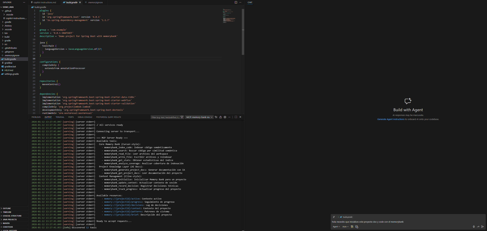

We initialize mcp by requesting indexing of documentation and code in the memory bank

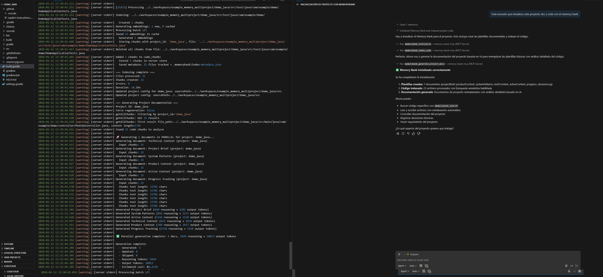

We wait about 5 minutes for every 100 files

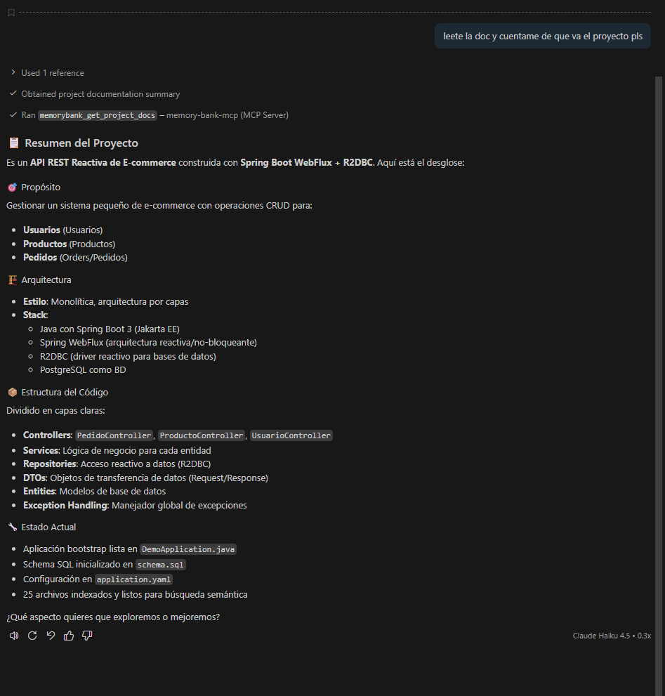

We asked for the general documentation to verify correct indexing.

> See the [MCP documentation](https://www.npmjs.com/package/@grec0/memory-bank-mcp) for more details.

### Step 3: Install the Extension

1. Open Visual Studio Code
2. Go to **Extensions** (`Ctrl+Shift+X`)
3. Search for **"Memory Bank Inspector"**
4. Click **Install**

### Step 4: Configure the Extension

After installation, configure the path where the MCP stores data:

1. Open **Settings** (`Ctrl+,`)
2. Search for `memorybank.path`
3. Enter the path to your `.memorybank` folder

```json
{
  "memorybank.path": "C:\\Users\\your-username\\.memorybank"
}
```

| Setting | Description |
|---------|-------------|
| `memorybank.path` | Path to the `.memorybank` folder generated by the MCP |
| `memorybank.openai.apiKey` | OpenAI API Key (optional, only for Code Relations AI descriptions) |

---

## Extension Features

### Sidebar Overview

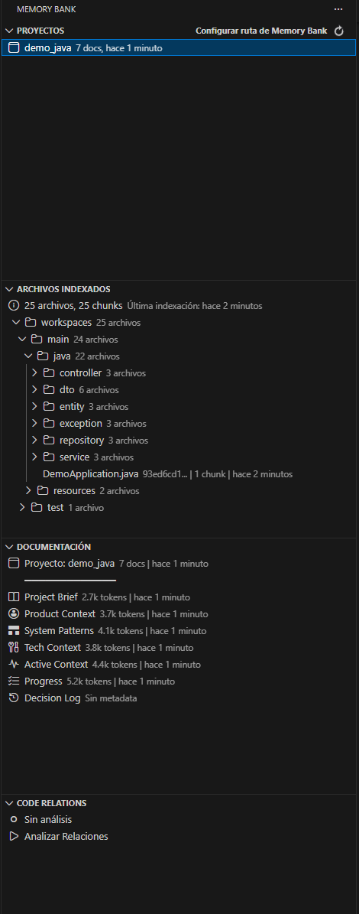

sidebar with the 4 extension panels

### Project Explorer

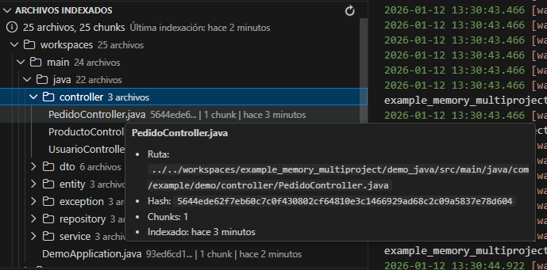

focus on the detail of an element of any tree

- Lists all projects indexed by the MCP
- Shows document count and last update
- Allows project deletion (includes embeddings cleanup)

### Indexed Files Tree

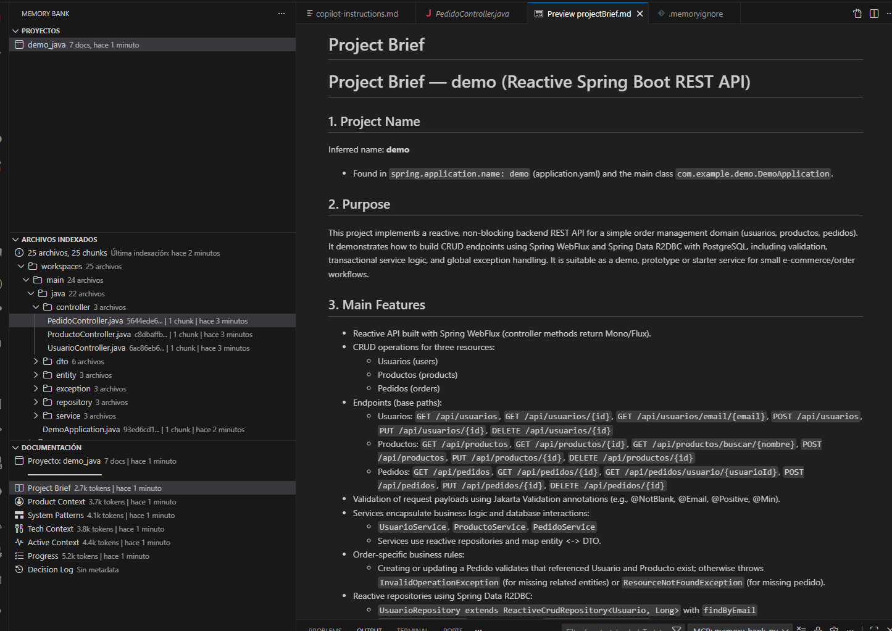

Opening generated project documentation file

- Navigate indexed files organized in folders
- View file information (chunks, hash)
- Open files directly in the editor

### Framework Components Explorer


Automatically detects frameworks (React, Spring Boot, NestJS, etc.) and lists components:

- **Component organization**: Groups files by their role (Controllers, Services, Components, Hooks, Stores)
- **Endpoint detection**: Shows HTTP endpoints and routes defined in the code
- **Easy navigation**: Jump directly to the component implementation
- **Supported frameworks**: Spring Boot, NestJS, Angular, React, Vue, Django, FastAPI, Flask, Express

### Documentation Viewer

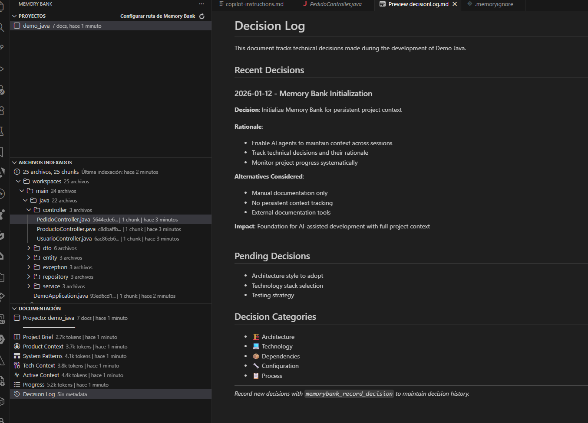

Opening generated project decision log file

View documentation automatically generated by the MCP:

- **projectBrief.md** - General project description
- **techContext.md** - Technology stack
- **systemPatterns.md** - Architecture patterns
- **activeContext.md** - Current session context
- **progress.md** - Project status
- **decisionLog.md** - Technical decisions

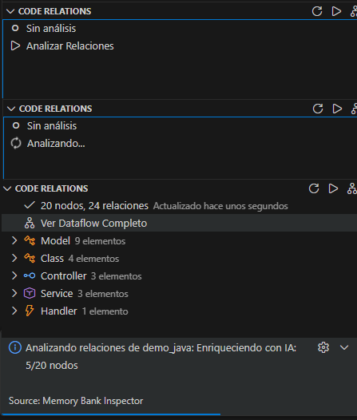

states and messages from the generation of the relationship dataflow for the entire project

### Code Relations (Dataflow Viewer)

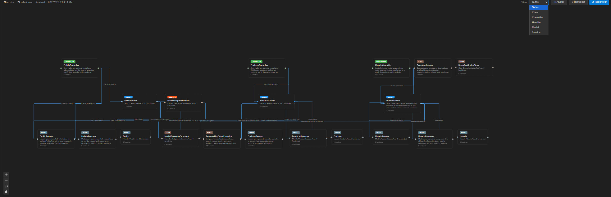

Example of the result generated for a relationship dataflow from a Java API

Visualize relationships between code components:

- Automatic analysis of imports and dependencies
- Interactive visualization with React Flow
- AI-generated descriptions (requires OpenAI API Key)
- Node highlighting when selecting to follow dependencies

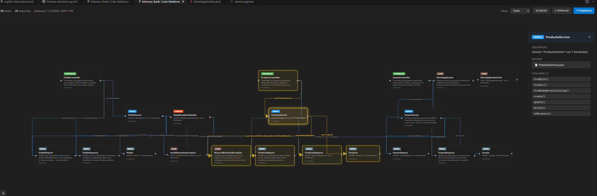

highlighting direct relationships with the selected entity


Highlighting of direct relationships with the selected entity and description of the service generated by AI

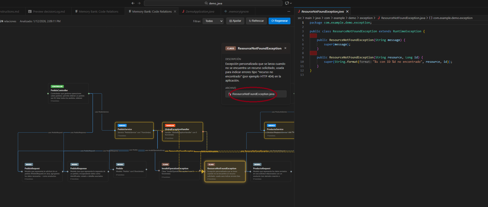

opening file directly from the dataflow

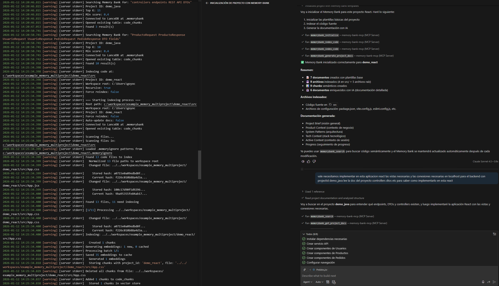

creating a React project and querying the previously indexed Java project to implement the necessary views and services

### Active Agents Monitor (Multi-Agent)


This view provides real-time visibility into the **Memory Bank MCP Multi-Agent System**. It visualizes the state of the `agentBoard.md` file, allowing developers to coordinate with AI agents.

**Features:**
- **Active Agents**: Displays all agents registered in the system (e.g., `Dev-Agent`, `Architect-Agent`), their current status (`ACTIVE`, `IDLE`), and their current task focus.
- **Resource Locking**: visualizes the **File Locks** system. See exactly which files are currently "claimed" by an agent to prevent race conditions during parallel work.
- **System Logs**: A live feed of coordination messages, showing when agents register, claim resources, or complete tasks.

**How it works:**
The extension watches for changes in `.memorybank/projects/{projectId}/docs/agentBoard.md`. When an MCP agent (using tools like `memorybank_manage_agents`) updates its status or locks a file, this view updates automatically.

### Working with AI Agents

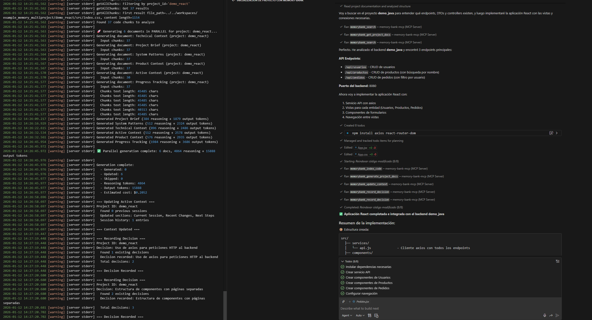

result of the previous step with auto-indexing by agents.md instructions

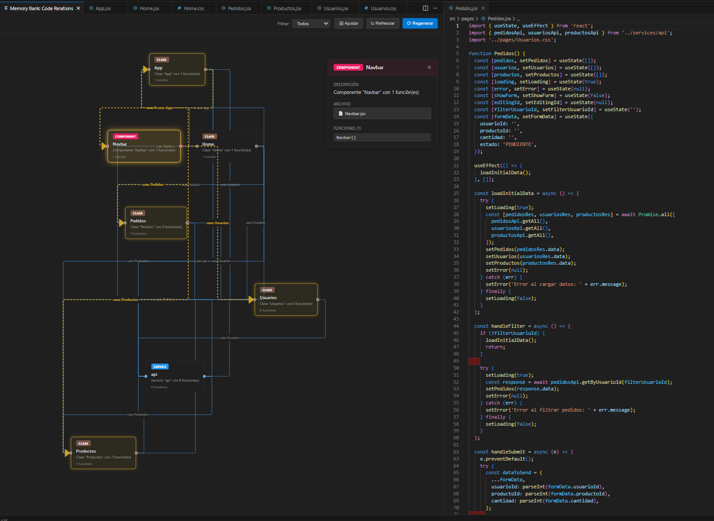

result of the previous step visualizing the dataflow generated for the demo_react project

---

## Requirements

- **Visual Studio Code** v1.26.0 or higher
- **Memory Bank MCP** installed and configured with indexed projects

---

## Links

- [Memory Bank MCP on NPM](https://www.npmjs.com/package/@grec0/memory-bank-mcp)
- [Memory Bank MCP on GitHub](https://github.com/gcorroto/memory-bank-mcp)
- [Report an issue](https://github.com/gcorroto/memory-bank-vscode/issues)

---

## License

MIT © [grec0](https://github.com/gcorroto)
