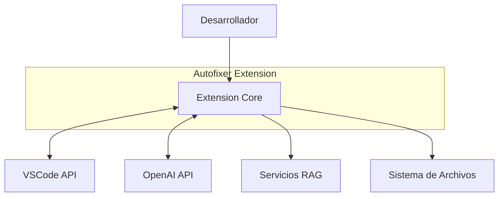
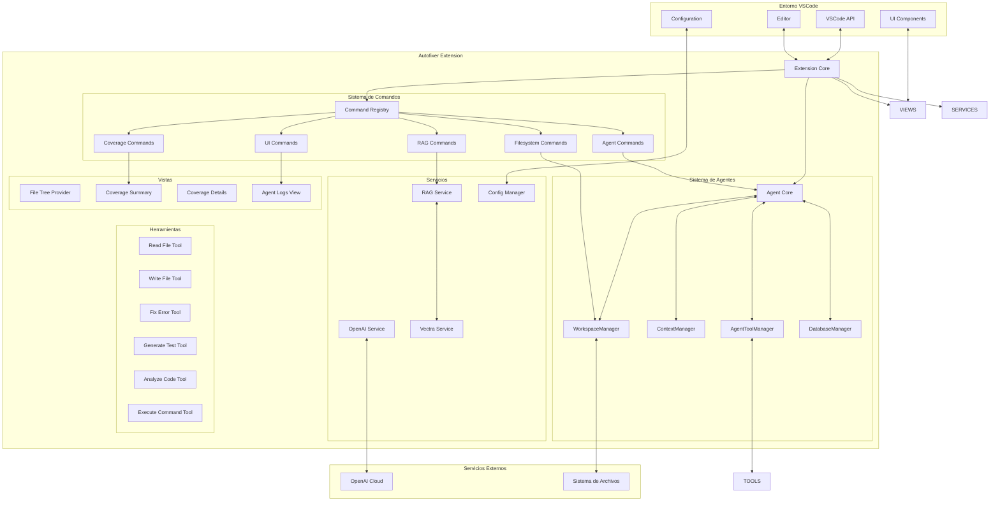
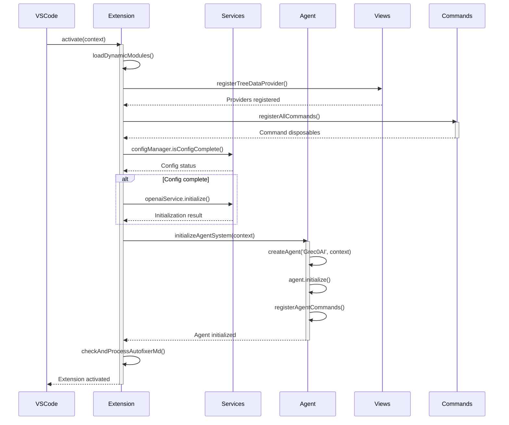
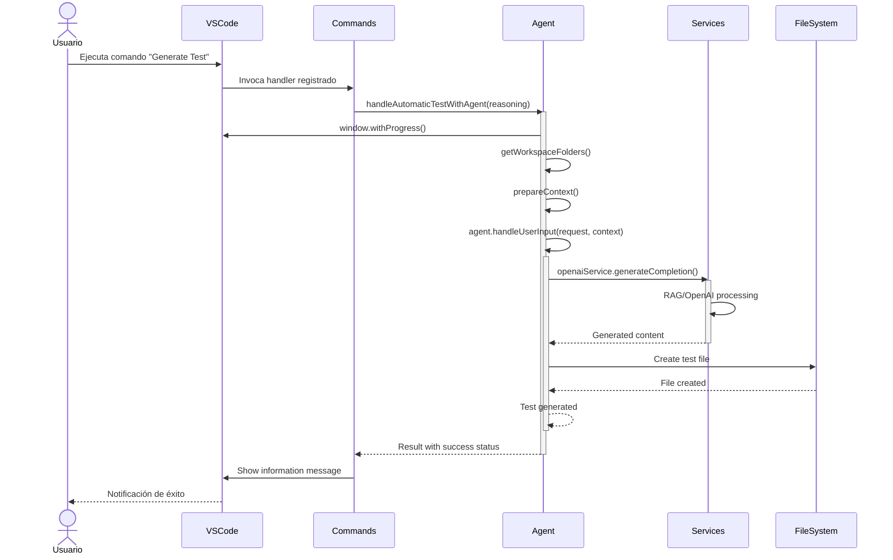
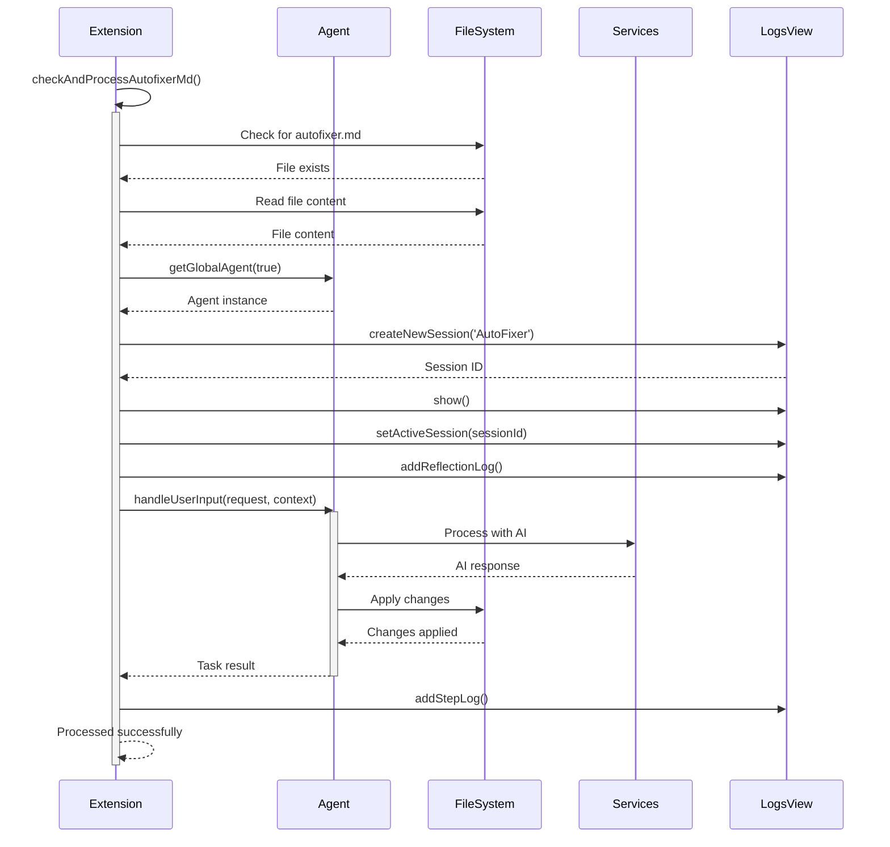
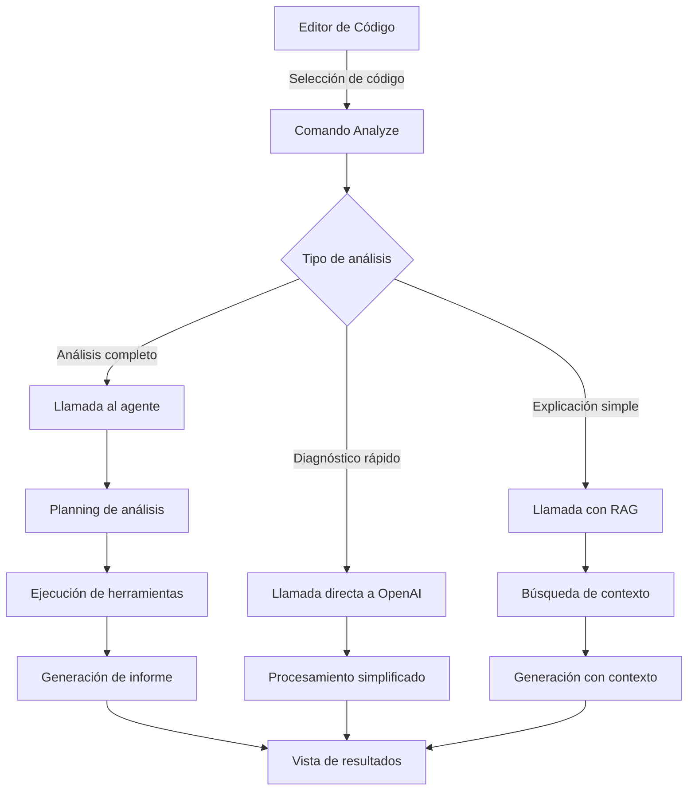
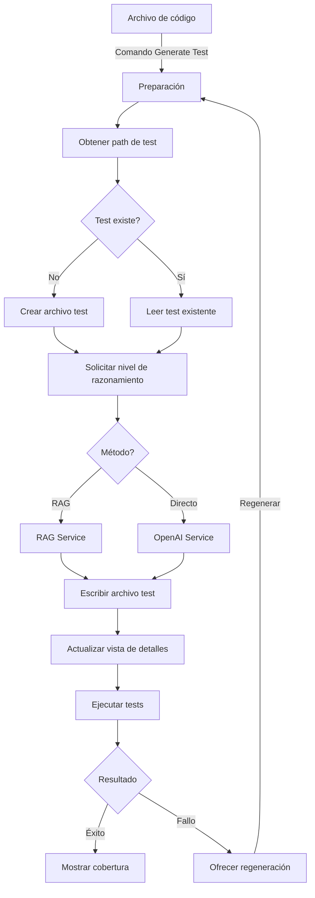
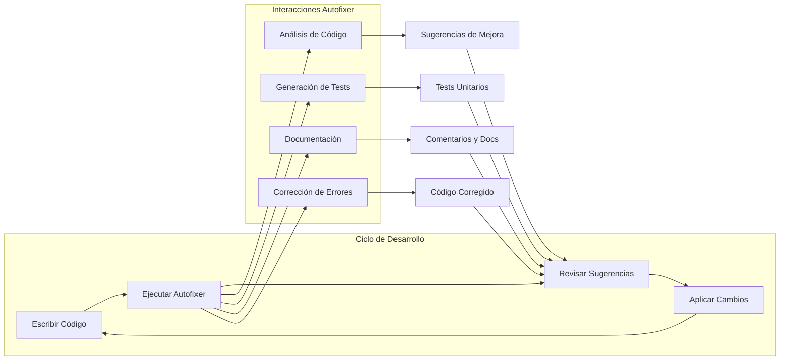
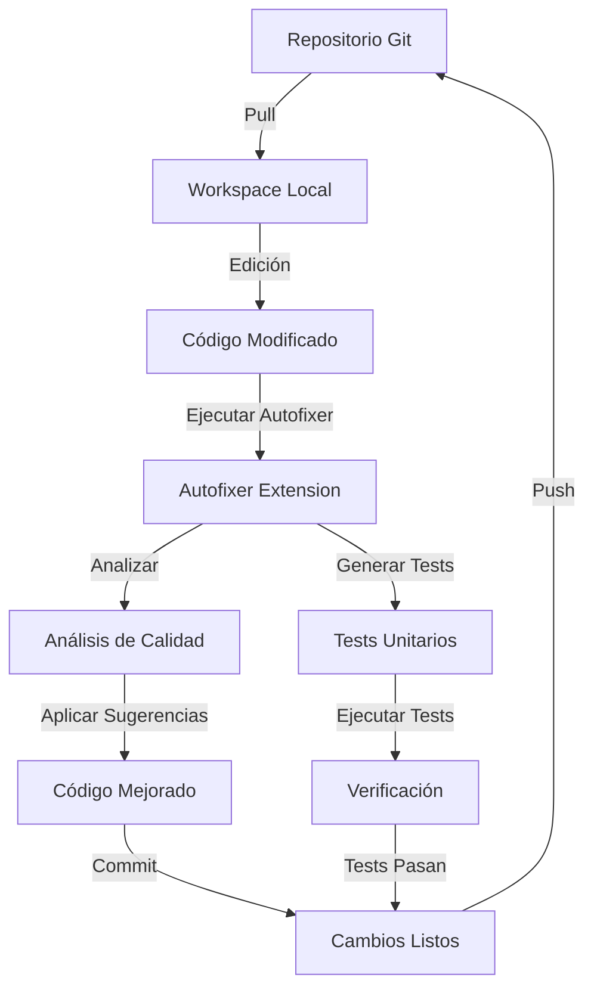

# Arquitectura de Comunicaciones - Autofixer Extension

## 1. Visión General

Este documento detalla la arquitectura de comunicaciones de la extensión Autofixer para VSCode, una plataforma que permite integrar capacidades de IA en el editor para mejorar la productividad de los desarrolladores.

El sistema integra las siguientes tecnologías clave:

- **VSCode API**: Proporciona las interfaces para interactuar con el editor.
- **OpenAI API**: Ofrece los modelos de IA para análisis de código, generación de tests y otras funcionalidades.
- **Sistema de Agentes**: Arquitectura basada en agentes para orquestar las operaciones de IA.
- **Servicios RAG**: Recuperación aumentada por generación para mejorar respuestas con contexto específico.

## 2. Componentes Principales

### 2.1. VSCode Extension API

- **Definición**: API que permite a la extensión interactuar con el entorno de VSCode.
- **Características**:
  - Gestión de comandos y eventos
  - Manipulación de documentos y editores
  - Creación de interfaces de usuario (vistas, paneles)
  - Gestión de configuraciones y preferencias

### 2.2. Sistema de Agentes

- **Definición**: Arquitectura que organiza las funcionalidades de IA en componentes modulares.
- **Componentes clave**:
  - **Agent Core**: Coordinador central de operaciones
  - **AgentToolManager**: Gestiona las herramientas disponibles para el agente
  - **ContextManager**: Mantiene el contexto de la conversación y operaciones
  - **WorkspaceManager**: Interactúa con el workspace de VSCode
  - **Tools**: Conjunto de herramientas para análisis y generación de código

### 2.3. Servicios IA

- **Definición**: Componentes que gestionan la comunicación con APIs de IA.
- **Componentes principales**:
  - **OpenAI Service**: Interfaz con la API de OpenAI
  - **Vectra Service**: Servicio para indexación y búsqueda vectorial
  - **RAG Service**: Sistema de recuperación aumentada por generación
  - **ConfigManager**: Gestión de configuraciones de servicios IA

### 2.4. Sistema de Comandos

- **Definición**: Estructura centralizada para registrar y ejecutar comandos.
- **Características**:
  - Organización por categorías funcionales
  - Gestión unificada de registros y disposables
  - Compatibilidad con comandos legacy y nuevos

### 2.5. Proveedores de Vista

- **Definición**: Componentes que proporcionan visualizaciones en la interfaz de VSCode.
- **Tipos**:
  - TreeView para estructura de archivos
  - Vistas de resumen de cobertura
  - Vistas de detalles y logs

## 3. Diagrama de Componentes Detallado

## 4. Flujo de Comunicación

### 4.1. Activación de la Extensión

### 4.2. Flujo de Comando de Generación de Tests

### 4.3. Flujo de Procesamiento de Autofixer.md

## 5. Interfaces y Protocolos

### 5.1. Interfaz Extension <-> VSCode API

- **Commands API**:
  - Registro de comandos a través de `vscode.commands.registerCommand`
  - Ejecución mediante `vscode.commands.executeCommand`
  - Disposables para gestión de ciclo de vida

- **View API**:
  - TreeDataProviders para vistas personalizadas
  - WebView para interfaces complejas
  - OutputChannel para logs y mensajes

- **Workspace API**:
  - Acceso a archivos mediante `vscode.workspace.fs`
  - Manejo de configuraciones con `vscode.workspace.getConfiguration`
  - Eventos de cambio en archivos y configuración

### 5.2. Interfaz Extension <-> OpenAI

- **REST API**:
  - Autenticación mediante API key
  - Solicitudes HTTP para completions y embeddings
  - Gestión de modelos y parámetros

- **Formato de mensajes**:
  - Sistema de roles (system, user, assistant)
  - Soporte para herramientas y funciones
  - Manejo de contexto y tokens

### 5.3. Interfaz de Sistema de Agentes

- **Agent Core API**:
  - Método principal `handleUserInput` para procesar solicitudes
  - Gestión de herramientas mediante AgentToolManager
  - Sistema de pasos con reflection y planning

- **Tool Interface**:
  - Método `execute` estandarizado
  - Sistema de tipos para parámetros y resultados
  - Documentación para uso por IA

## 6. Consideraciones Técnicas

### 6.1. Gestión de Configuración

- **Almacenamiento seguro**: Las claves API se guardan en el almacenamiento seguro de VSCode
- **Configuración por workspace**: Opciones específicas por proyecto
- **Configuración global**: Preferencias a nivel de usuario

### 6.2. Manejo de Errores

- **Sistema de retry**: Para fallos de comunicación con OpenAI
- **Degradación graceful**: Alternativas cuando servicios avanzados no están disponibles
- **Mensajes descriptivos**: Información clara sobre errores para el usuario

### 6.3. Optimización de Rendimiento

- **Lazy loading**: Carga diferida de módulos pesados
- **Caché de respuestas**: Para reducir llamadas a OpenAI
- **Procesamiento asíncrono**: Para mantener la responsividad de la UI

## 7. Flujos de Integración

### 7.1. Flujo de Análisis de Código

### 7.2. Flujo de Generación de Tests

## 8. Conclusiones

La arquitectura de comunicaciones de la extensión Autofixer representa una solución compleja y robusta para integrar capacidades de IA en el entorno de desarrollo VSCode. El diseño modular permite:

- **Extensibilidad**: Fácil adición de nuevas funcionalidades y herramientas
- **Mantenibilidad**: Separación clara de responsabilidades
- **Rendimiento**: Optimización de recursos y carga diferida
- **Experiencia de usuario**: Interfaz fluida y responsive

La extensión aprovecha las capacidades de la API de VSCode y las combina con tecnologías avanzadas de IA para crear una herramienta potente que mejora significativamente la productividad de los desarrolladores.

## 9. Casos de Uso Principales

Los siguientes diagramas muestran los principales casos de uso de la extensión Autofixer:

### 9.1. Flujo de Trabajo de Desarrollo con Autofixer

### 9.2. Integración con Flujo de Trabajo en Equipo

