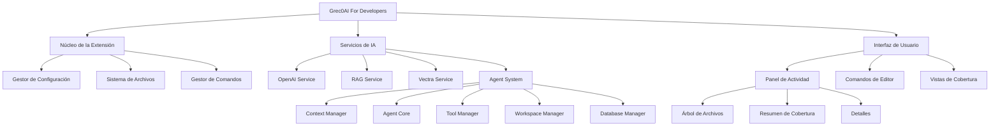
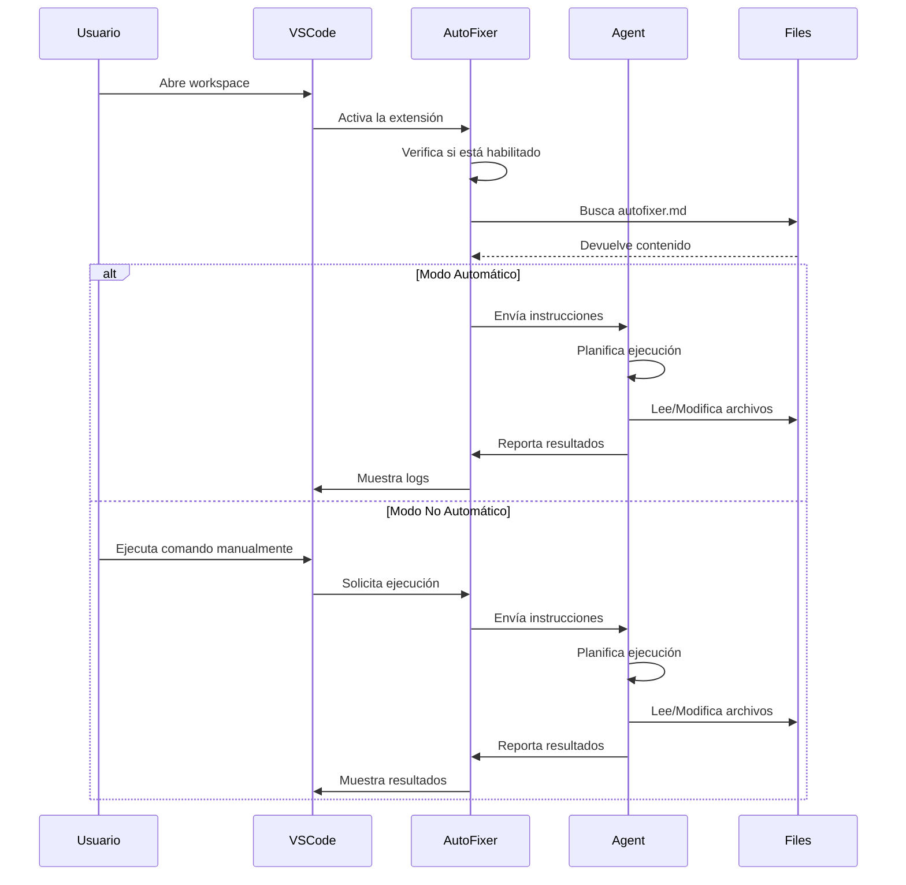
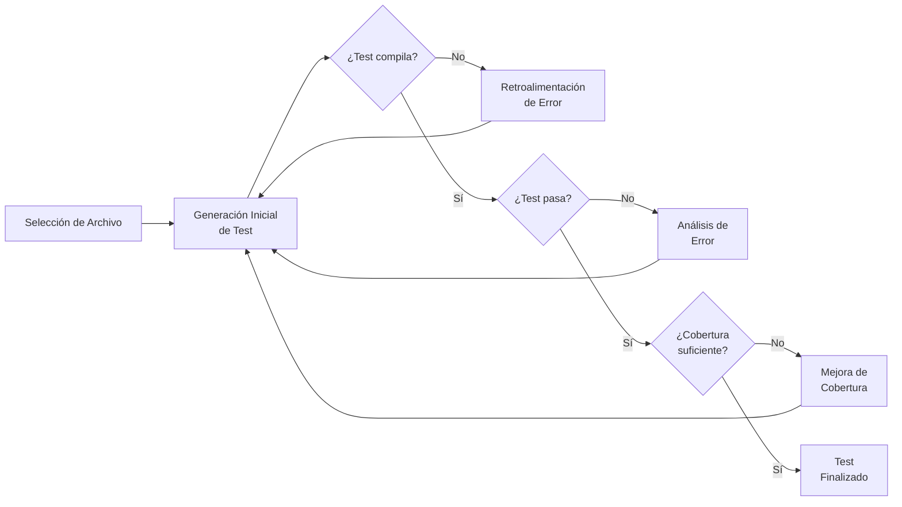
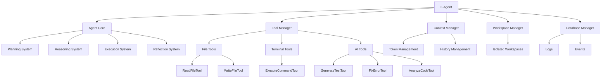
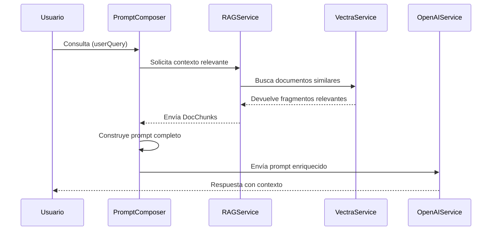
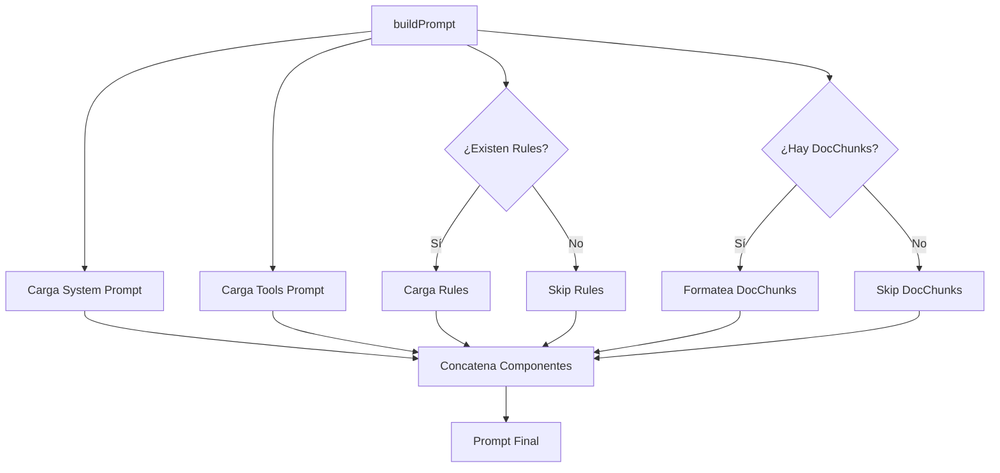

# Diagramas de la Arquitectura de Grec0AI

Este documento contiene diagramas explicativos para entender los principales procesos y la arquitectura de la extensión Grec0AI For Developers.

## Arquitectura General de la Extensión

Este diagrama muestra la estructura general de la extensión y cómo se relacionan sus diferentes componentes.

## Flujo de Trabajo de AutoFixer

Este diagrama detalla el proceso de funcionamiento de la característica AutoFixer.

## Proceso de Generación de Tests con IA

Este diagrama muestra el ciclo de generación y mejora de tests unitarios usando IA.

## Arquitectura basada en Agentes (II-Agent)

Este diagrama detalla la arquitectura del sistema de agentes inteligentes.

## Proceso de Consulta RAG (Retrieval Augmented Generation)

Este diagrama ilustra cómo funciona el sistema RAG para mejorar las respuestas del asistente MacGyver.

## Arquitectura del PromptComposer

Este diagrama muestra cómo se construyen los prompts para MacGyver.

