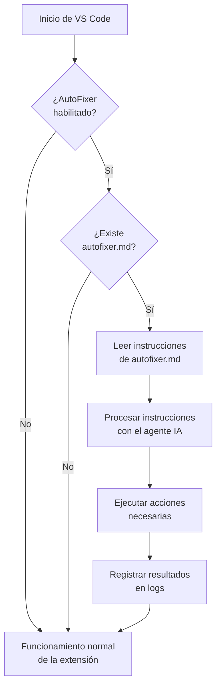

# Guía de Uso de AutoFixer

## ¿Qué es AutoFixer?

AutoFixer es una característica potente de la extensión Grec0AI que permite ejecutar instrucciones de forma automática al abrir un workspace de VS Code. Esta funcionalidad está diseñada para entornos CI/CD, despliegues automáticos y flujos de trabajo que requieren acciones automatizadas sin intervención manual.

## Modos de Funcionamiento

AutoFixer puede funcionar en dos modos principales:

### Modo Automático

En el modo automático, AutoFixer ejecuta instrucciones automáticamente al iniciar VS Code sin requerir intervención del usuario.

**Activación del modo automático:**

Existen dos formas de habilitar el modo automático:

1. **Usando la configuración de VS Code**:
   - Abre la configuración de VS Code (presiona `Ctrl+,`)
   - Busca `grec0ai.autofixer.enabled`
   - Marca la casilla para activarlo (establece el valor en `true`)

2. **Usando una variable de entorno**:
   - Configura la variable de entorno `GREC0AI_AUTOFIXER=1` en tu sistema
   - Esto es especialmente útil para entornos CI/CD o contenedores

**Funcionamiento:**
1. Al iniciar VS Code, AutoFixer busca un archivo llamado `autofixer.md` en la raíz del proyecto
2. Si encuentra este archivo, lee las instrucciones contenidas en él
3. Ejecuta estas instrucciones automáticamente, sin mostrar confirmaciones
4. Los resultados se guardan en el canal de salida de Grec0AI

### Modo No Automático (Manual)

En el modo no automático, AutoFixer está desactivado por defecto (por razones de seguridad) y las acciones sólo se ejecutan cuando el usuario las solicita explícitamente.

**Funcionamiento:**
1. Crea o edita un archivo `autofixer.md` en la raíz de tu proyecto con las instrucciones deseadas
2. Para ejecutar las instrucciones, utiliza el comando "Grec0AI: Agent Execute Task" desde la paleta de comandos
3. El agente procesará las instrucciones del archivo y te mostrará los resultados

## Creación de un Archivo autofixer.md

El archivo `autofixer.md` debe escribirse en formato Markdown y contener instrucciones en lenguaje natural para el agente. Por ejemplo:

```markdown
# Correcciones Automáticas de Código

Por favor, realiza las siguientes tareas:

1. Corrige el error en la función `calcularTotal()` en `src/utils/calculadora.js` 
2. Añade manejo de errores adecuado a las llamadas API en `src/servicios/api.js`
3. Aumenta la cobertura de pruebas para el componente `UsuarioServicio` a al menos 80%
```

## Casos de Uso

- **Configuración de entornos automatizada**: Corregir problemas comunes cuando nuevos desarrolladores clonan el repositorio
- **Pipelines CI/CD**: Generar o actualizar código como parte de flujos de trabajo automatizados
- **Entornos en contenedores**: Aplicar correcciones al desplegar en entornos VSCode containerizados como Code Server
- **Inicialización de proyectos**: Configurar de manera consistente nuevas instancias de un proyecto

## Diagrama de Flujo de AutoFixer



## Opciones de Configuración

| Configuración | Tipo | Valor Predeterminado | Descripción |
|---------------|------|----------------------|-------------|
| `grec0ai.autofixer.enabled` | boolean | false | Habilita o deshabilita la ejecución automática de instrucciones desde el archivo autofixer.md al iniciar |

También se puede activar mediante la variable de entorno `GREC0AI_AUTOFIXER=1`.

## Notas Importantes

- AutoFixer está desactivado por defecto por motivos de seguridad
- No se muestran confirmaciones cuando AutoFixer está funcionando en modo automático
- Si el archivo `autofixer.md` no se encuentra, la extensión continuará con la operación normal sin errores
- Todas las acciones realizadas por AutoFixer se registran en el canal de salida de Grec0AI
- Revisa cuidadosamente las instrucciones en tu archivo `autofixer.md` antes de activar el modo automático

## Consideraciones de Seguridad

Es importante tener en cuenta que AutoFixer ejecuta código sin confirmaciones cuando está en modo automático. Por seguridad:

1. Usa esta funcionalidad solo en entornos confiables
2. Revisa siempre el contenido del archivo `autofixer.md` antes de activar AutoFixer
3. Limita los permisos en entornos compartidos
4. Considera utilizar el modo no automático en entornos de desarrollo local

## Solución de Problemas

| Problema | Posible Solución |
|----------|------------------|
| AutoFixer no se ejecuta automáticamente | Verifica que `grec0ai.autofixer.enabled` está configurado como `true` o que la variable de entorno `GREC0AI_AUTOFIXER` está establecida en `1` |
| Las instrucciones no se ejecutan correctamente | Asegúrate de que tus instrucciones en `autofixer.md` están escritas claramente en lenguaje natural |
| Errores durante la ejecución | Revisa los logs en el canal de salida de Grec0AI para identificar el problema |